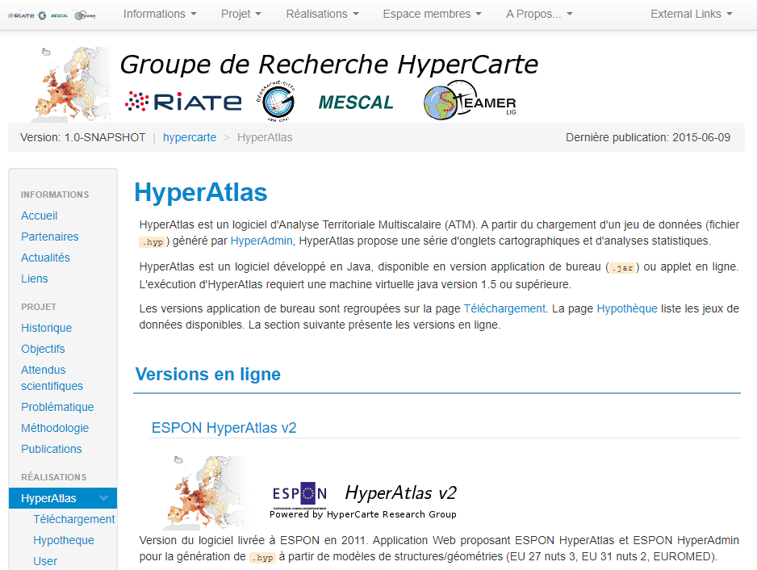
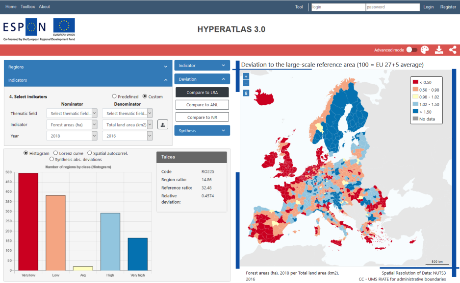
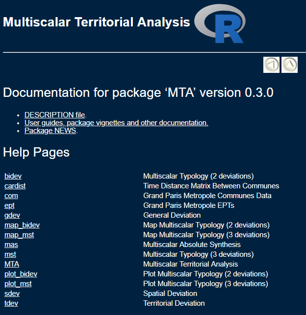
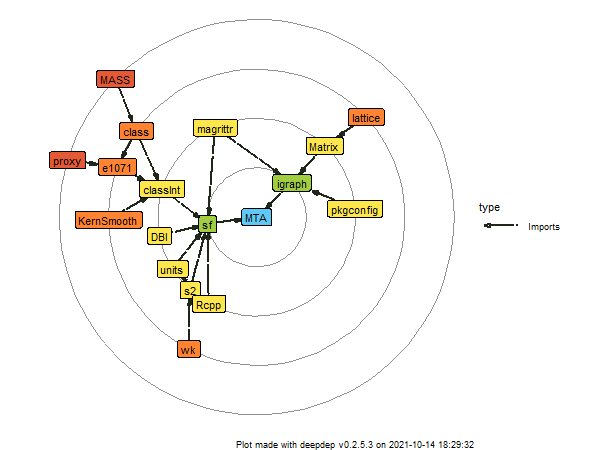
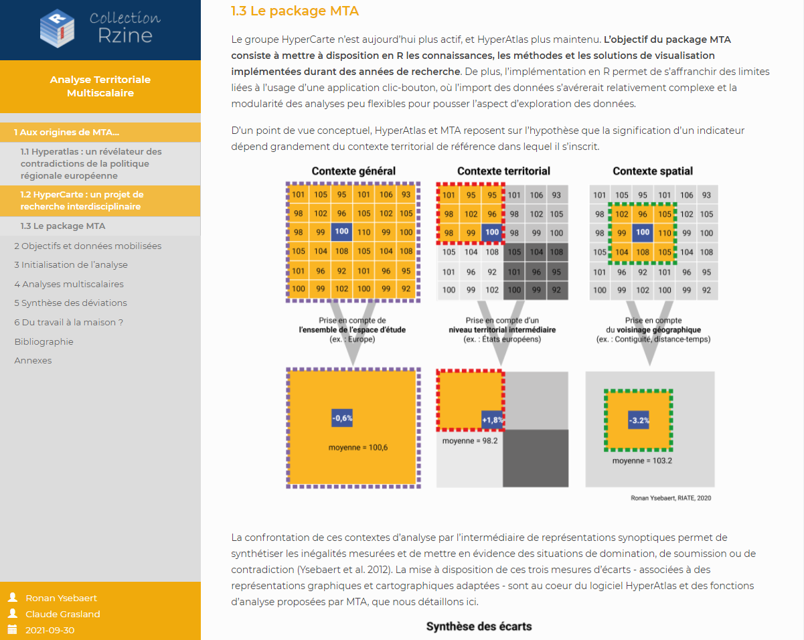
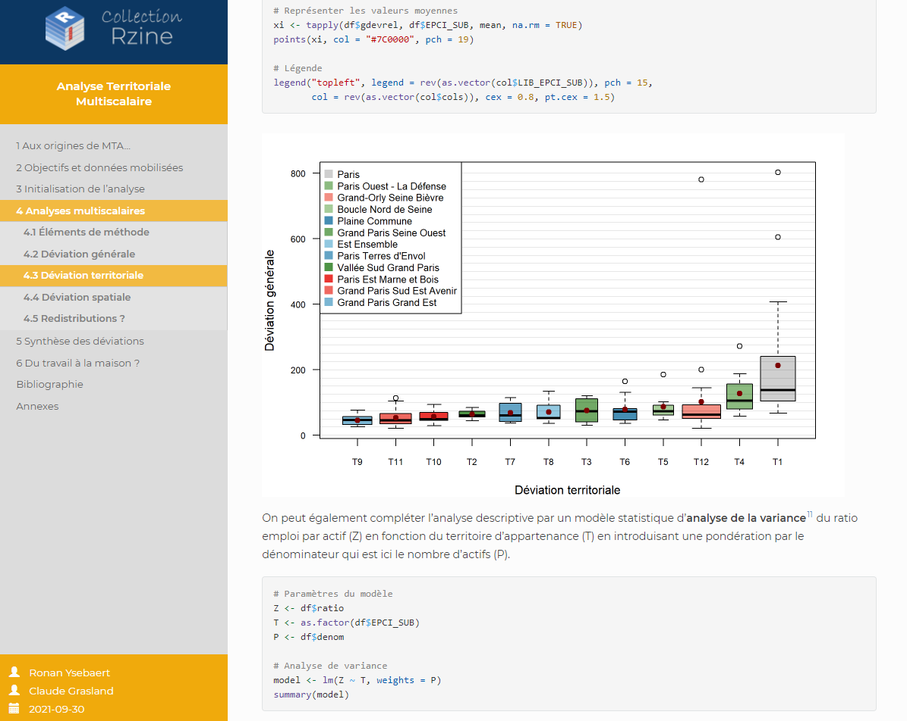

```{r setup, include=FALSE}
options(htmltools.dir.version = FALSE, crayon.enabled = TRUE)
knitr::opts_chunk$set(cache = TRUE,
                      fig.align='center',
                      message = FALSE,
                      warning = TRUE)
# install.packages("devtools")
# devtools::install_github("gadenbuie/countdown")
# devtools::install_github("mitchelloharawild/icons")
library(countdown)
library(icons)
#download_fontawesome()
```

#  Déroulé

- Présentation du concept de l'analyse territoriale multiscalaire
- Historique des travaux
- Arrivée de mta
- Cas d'étude

---


# Concept


---

## Contexte général

.center[


.leg-fig[*Ronan Ysebaert, RIATE, 2021*]
]


---

## Contexte général

.center[


.leg-fig[*Ronan Ysebaert, RIATE, 2021*]
]


---

## Contexte général

.center[


.leg-fig[*Ronan Ysebaert, RIATE, 2021*]
]


---

## Contexte général

.center[


.leg-fig[*Ronan Ysebaert, RIATE, 2021*]
]

---

## Contexte territorial

.center[


.leg-fig[*Ronan Ysebaert, RIATE, 2021*]
]

---

## Contexte territorial

.center[


.leg-fig[*Ronan Ysebaert, RIATE, 2021*]
]

---

## Contexte territorial

.center[


.leg-fig[*Ronan Ysebaert, RIATE, 2021*]
]

---

## Contexte spatial

.center[


.leg-fig[*Ronan Ysebaert, RIATE, 2021*]
]

---

## Contexte spatial

.center[


.leg-fig[*Ronan Ysebaert, RIATE, 2021*]
]

---

## Contexte spatial

.center[


.leg-fig[*Ronan Ysebaert, RIATE, 2021*]
]


---

## 15 ans de recherche interdisciplinaire autour d'HyperAtlas


.pull-left[

.medium[

- **1990's** : Travaux de C. Grasland, H. Mathian et J.C François sur la distribution de phénomènes sociaux discrets dans l'espace ([appartenances](http://census.web.ined.fr/debat/Contributions/Avant-Fevrier-1999/Grasland-2.html) et [discontinuités territoriales](https://www.persee.fr/doc/spgeo_0046-2497_1997_num_26_4_1097)).

- **2000** Création du groupe de recherche HyperCarte

.center[

]

- **2006** : Première version d'HyperAtlas. 

- **2011** : Seconde version d'HyperAtlas (nouveaux outils statistiques, implémentation de la carte de synthèse - 2 déviations). 
]
]

.pull-right[
.center[


.leg-fig[*HyperAtlas v2*]
]
]

---

## 15 ans de recherche interdisciplinaire autour d'HyperAtlas

.pull-left[

.medium[

- **1990's** : Travaux de C. Grasland, H. Mathian et J.C François sur la distribution de phénomènes sociaux discrets dans l'espace ([appartenances](http://census.web.ined.fr/debat/Contributions/Avant-Fevrier-1999/Grasland-2.html) et [discontinuités territoriales](https://www.persee.fr/doc/spgeo_0046-2497_1997_num_26_4_1097)).

- **2000** Création du groupe de recherche HyperCarte

.center[

]

- **2006** : Première version d'HyperAtlas. 

- **2011** : Seconde version d'HyperAtlas (nouveaux outils statistiques, implémentation de la carte de synthèse - 2 déviations). 

- **2015** : Fin du groupe de recherche HyperCarte. Travaux résumés dans un [site Web](http://hypercarte.imag.fr/) (Le Rubrus, 2015).
]
]

.pull-right[
.center[


.leg-fig[[*http://hypercarte.imag.fr/*](http://hypercarte.imag.fr/, le site Web du groupe de recherche)
]
]
]

---

## 15 ans de recherche interdisciplinaire autour d'HyperAtlas

.pull-left[

.medium[

- **1990's** : Travaux de C. Grasland, H. Mathian et J.C François sur la distribution de phénomènes sociaux discrets dans l'espace ([appartenances](http://census.web.ined.fr/debat/Contributions/Avant-Fevrier-1999/Grasland-2.html) et [discontinuités territoriales](https://www.persee.fr/doc/spgeo_0046-2497_1997_num_26_4_1097)).

- **2000** Création du groupe de recherche HyperCarte

.center[

]

- **2006** : Première version d'HyperAtlas. 

- **2011** : Seconde version d'HyperAtlas (nouveaux outils statistiques, implémentation de la carte de synthèse - 2 déviations). 

- **2015** : Fin du groupe de recherche HyperCarte. Travaux résumés dans un [site Web](http://hypercarte.imag.fr/) (Le Rubrus, 2015).

- **2021** : [ESPON HyperAtlas 3.0](https://www.espon.eu/HyperAtlas-3.0) (ÖIR) : nouveau design, connexion à la base de données ESPON... 
]
]

.pull-right[
.center[


.leg-fig[[*Tools and maps / HyperAtlas 3.0 - User Manual, draft*]https://www.espon.eu/sites/default/files/attachments/D3_Draft-User-Manual_11.pdf)
]
]
]
---

## Implémentations  

.pull-left[
- Contexte transnational / européen : ESPON, [Nordregio](https://www.diva-portal.org/smash/get/diva2:700421/FULLTEXT01.pdf)

- Enseignement des disparités socio-spatiales au sein de l'UE en première. 

]

.pull-right[

]

---

## Retour sur expérience d'HyperAtlas

.pull-left[

- Concept de l'analyse multiscalaire facilement appréhendable par une diversité d'acteurs. Beaucoup de demandes d'implémentation.

- Une application clic-bouton mûrement réfléchie (parcours utilisateur).

- Un projet interdisciplinaire par essence. 
]

.pull-right[

- Application vieillissante (ergonomie).

- Processus de création d'un .hyp (données d'entrée d'HyperAtlas) assez coûteux. 

- Une application qui dépend du développement successif de plusieurs ingénieurs (difficile à faire évoluer).

- Export vectoriel des cartes et graphiques impossible sous HyperAtlas. 
]

--

**Nécessité de trouver une alternative pour les travaux et analyses exploratoires à toute personne intéressée par ce cadre conceptuel. 

---

# MTA

---

## Le package MTA

.pull-left[

- **M**ultiscalar **T**erritorial **A**nalysis

- Déposé sur le CRAN en mars 2017.

- 10 fonctions : `gdev`, `tdev`, `sdev`, `bidev`, `mst`, `mas`, `map_bidev`, `map_mst`, `plot_bidev`, `plot_mst` 

- Un jeu de données d'exemple (inégalités de revenu sur la Métropole du Grand Paris)

- 2 vignettes explicatives (concepts théoriques et application)

- version 0.4.0 (dernière mise à jour : octobre 2021)

]

.pull-right[


]


---

## Développement

```{r, echo = FALSE, eval = FALSE, results='hide'}
library(deepdep)
dep <- deepdep("MTA", depth = 6)
png("figures/deps.png", width  = 600, height = 450)
plot_dependencies(dep, "circular", same_level = TRUE, reverse = TRUE, main = 'toto')
dev.off()
```

.center[

]

---

# Exemple d'utilisation
*Concentration de l'emploi dans la Métropole du Grand Paris*

---

.pull-left[
## Librairies utilisées

**MTA** : Calcul des déviations, représentations graphiques de synthèse des déviations.

**sf** : Manipulation de données spatiales. 

**mapsf** : Représentations cartographiques. 

```{r}
library(MTA)
library(sf)
library(mapsf)
```
]

.pull-right[
## Le jeu de données

**Couverture géographique / maille territoriale** : Communes appartenant à une des 22 métropoles françaises (Source [IGN, 2021](https://geoservices.ign.fr/contoursiris) / [INSEE, 2021](https://www.insee.fr/fr/information/2028028)).

**Un numérateur** : Emplois au lieu de travail en 2016 (Source : [INSEE, 2021](https://www.insee.fr/fr/statistiques/4171446?sommaire=4171473))

**Un dénominateur** : Actifs de 15 à 64 en 2016, au lieu de résidence (Source : [INSEE, 2021](https://www.insee.fr/fr/statistiques/4228432))

**Une variable d'appartenance** : EPCI (communauté d'agglomération) d'appartenance de la commune (Source : [RIATE, 2021](https://github.com/rysebaert/mta_rzine/blob/main/data/metropoles.xlsx))

```{r}
# Import des données
com <- st_read("data/data.gpkg", layer = "com", quiet = TRUE)
epci <- st_read("data/data.gpkg", layer = "epci", quiet = TRUE)

# Filtrer sur Paris
com <- com[com$LIB_EPCI == "Métropole du Grand Paris",]
epci <- epci[epci$LIB_EPCI == "Métropole du Grand Paris",]
```
]


---

## Le jeu de données

```{r}
head(com)
```


---

## Initialisation de l'analyse

.pull-left[
```{r, eval = FALSE}
# Initialisation de l'analyse
num <- which(colnames(com) == "P16_EMPLT")
denom <- which(colnames(com) == "C16_ACTOCC1564")
colnames(com)[c(num,denom)] <- c("num", "denom") 

# Retirer les valeurs égales à 0
com <- com[com$num != 0 & com$denom != 0,]

# Calculer le ratio de référence
com$ratio <- com$num / com$denom  

# Représentation cartographique
mf_map(x = com, var = "ratio", type = "choro", 
       breaks = "quantile", nbreaks = 4,
       border = "white", 
       leg_title = paste0("Emploi au lieu de travail /\n", 
                          "Actifs occupés au lieu", 
                          "de résidence, 2016"))

# EPCI
mf_map(epci, col = NA, lwd = 1, add = TRUE)

# Sources 
credits <- paste0("Sources : INSEE, IGN, 2021 / ",
                  "Réalisation : R. Ysebaert, 2021")

mf_layout(title = paste0("Ratio d'intérêt : concentration ", 
                         "d'emploi au lieu de travail",
                         "dans la MGP"),
          credits = credits)
```

]

.pull-right[
```{r, echo = FALSE, dpi = 300}
# Initialisation de l'analyse
num <- which(colnames(com) == "P16_EMPLT")
denom <- which(colnames(com) == "C16_ACTOCC1564")
colnames(com)[c(num,denom)] <- c("num", "denom") 

# Retirer les valeurs égales à 0
com <- com[com$num != 0 & com$denom != 0,]

# Calculer le ratio de référence
com$ratio <- com$num / com$denom  

# Représentation cartographique
mf_map(x = com, var = "ratio", type = "choro", 
       breaks = "quantile", nbreaks = 4,
       border = "white", 
       leg_title = paste0("Emploi au lieu de travail /\n", 
                          "Actifs occupés au lieu", 
                          "de résidence, 2016"))

# EPCI
mf_map(epci, col = NA, lwd = 1, add = TRUE)

# Sources 
credits <- paste0("Sources : INSEE, IGN, 2021 / ",
                  "Réalisation : R. Ysebaert, 2021")

mf_layout(title = paste0("Ratio d'intérêt : concentration d'emploi", 
                         " au lieu de travail dans la MGP"),
          credits = credits)
```

]

---
## Déviation générale : écart à la moyenne de la MGP

.pull-left[
```{r, eval = FALSE}
# Déviation générale
com$gdevrel <- gdev(x = com,  var1 = "num", var2 = "denom", 
                    type = "rel")

# Palette de couleurs pour déviations(origine Color Brewer)
devpal <-  c("#4575B4", "#91BFDB", "#E0F3F8", "#FEE090", 
             "#FC8D59", "#D73027")

# Cartographie
mf_map(x = com, var = "gdevrel", type = "choro", 
       breaks = c(min(com$gdevrel), 75, 90, 100, 111, 133, 
                  max(com$gdevrel)),
       border = "white", pal = devpal, 
       leg_title = paste0("Déviation au contexte général",
                          "\n(100 = moyenne de la MGP)"))
mf_map(epci, col = NA, lwd = 1, add = TRUE)
mf_layout(title = "Déviation générale", credits = credits)

# Labels 
mf_label(x = com[which.min(com$gdevrel),], var = "NOM_COM",
         halo = TRUE)
mf_label(x = com[which.max(com$ratio),], var = "NOM_COM",
         halo = TRUE)
```

]

.pull-right[
```{r, echo = FALSE, dpi = 300}
# Déviation générale
com$gdevrel <- gdev(x = com,  var1 = "num", var2 = "denom",  
                    type = "rel")

# Palette de couleurs pour déviations(origine Color Brewer)
devpal <-  c("#4575B4", "#91BFDB", "#E0F3F8", "#FEE090", 
             "#FC8D59", "#D73027")

# Cartographie
mf_map(x = com, var = "gdevrel", type = "choro", 
       breaks = c(min(com$gdevrel), 75, 90, 100, 111, 133, 
                  max(com$gdevrel)),
       border = "white", pal = devpal, 
       leg_title = paste0("Déviation au contexte général",
                          "\n(100 = moyenne de la MGP)"))
mf_map(epci, col = NA, lwd = 1, add = TRUE)

mf_layout(title = "Déviation générale", credits = credits)

# Labels 
mf_label(x = com[which.min(com$gdevrel),], var = "NOM_COM", halo = TRUE)
mf_label(x = com[which.max(com$ratio),], var = "NOM_COM", halo = TRUE)
```
]

---

## Déviation territoriale : écart à l'EPCI d'appartenance

.pull-left[
```{r, eval = FALSE}
# Déviation territoriale
com$tdevrel <- tdev(x = com,  var1 = "num", var2 = "denom", 
                    key = "LIB_EPCI_SUB")

# Cartographie
mf_map(x = com, var = "tdevrel", type = "choro", 
       breaks = c(min(com$tdevrel), 75, 90, 100, 111, 133, 
                  max(com$tdevrel)),
       border = "white", pal = devpal, 
       leg_title = paste0("Déviation au contexte territorial",
                          "\n(100 = moyenne de l'EPCI",
                          " d'appartenance"))
 
mf_layout(title = "Déviation territoriale", credits = credits)

# Extraction du maximum et du minimum par EPCI, puis affichage
df.agg <- aggregate(tdevrel ~ LIB_EPCI_SUB, com, FUN = max)
df.max <- merge(df.agg, com)
df.max <- st_as_sf(df.max)

df.agg <- aggregate(tdevrel ~ LIB_EPCI_SUB, com, FUN = min)
df.min <- merge(df.agg, com)
df.min <- st_as_sf(df.min)

mf_label(x = df.max, var = "NOM_COM", halo = TRUE, 
         col = "#8B1713")
mf_label(x = df.min, var = "NOM_COM",  halo = TRUE,
         col = "#135D89")
```

]

.pull-right[
```{r, echo = FALSE, dpi = 300}
# Déviation territoriale
com$tdevrel <- tdev(x = com,  var1 = "num", var2 = "denom", 
                    key = "LIB_EPCI_SUB")

# Cartographie
mf_map(x = com, var = "tdevrel", type = "choro", 
       breaks = c(min(com$tdevrel), 75, 90, 100, 111, 133, 
                  max(com$tdevrel)),
       border = "white", pal = devpal, 
       leg_title = paste0("Déviation au contexte territorial",
                          "\n(100 = moyenne de l'EPCI",
                          " d'appartenance"))
mf_map(epci, col = NA, lwd = 1, add = TRUE)
mf_layout(title = "Déviation territoriale", credits = credits)

# Extraction du maximum et du minimum par EPCI, puis affichage
df.agg <- aggregate(tdevrel ~ LIB_EPCI_SUB, com, FUN = max)
df.max <- merge(df.agg, com)
df.max <- st_as_sf(df.max)

df.agg <- aggregate(tdevrel ~ LIB_EPCI_SUB, com, FUN = min)
df.min <- merge(df.agg, com)
df.min <- st_as_sf(df.min)

mf_label(x = df.max, var = "NOM_COM", halo = TRUE, col = "#8B1713")
mf_label(x = df.min, var = "NOM_COM",  halo = TRUE, col = "#135D89")
```
]

---

## Déviation spatiale : contigüité territoriale

.pull-left[
```{r, eval = FALSE}
# Déviation spatiale
com$sdevrel <- sdev(x = com,  var1 = "num", var2 = "denom", 
                    order = 1)

# Cartographie
mf_map(x = com, var = "sdevrel", type = "choro", 
       breaks = c(min(com$sdevrel), 75, 90, 100, 111, 133, 
                  max(com$sdevrel)),
       border = "white", pal = devpal, 
       leg_title = paste0("Déviation au contexte territorial",
                          "\n(100 = moyenne des communes",
                          " contigües"))
mf_layout(title = "Déviation spatiale", credits = credits,
          arrow = FALSE)
```

]

.pull-right[
```{r, echo = FALSE, dpi = 300}
# Déviation spatiale
com$sdevrel <- sdev(x = com,  var1 = "num", var2 = "denom", 
                    order = 1)

# Cartographie
mf_map(x = com, var = "sdevrel", type = "choro", 
       breaks = c(min(com$sdevrel), 75, 90, 100, 111, 133, 
                  max(com$sdevrel)),
       border = "white", pal = devpal, 
       leg_title = paste0("Déviation au contexte territorial",
                          "\n(100 = moyenne des communes",
                          " contigües"))
mf_layout(title = "Déviation spatiale", credits = credits,
          arrow = FALSE)
```
]


---

## Déviation spatiale : contigüité territoriale

.pull-left[
```{r, eval = FALSE}
# Extraction des limites communales 
borders <- st_intersection(st_buffer(com, 5), st_buffer(com, 5)) 
borders <- st_cast(borders,"MULTILINESTRING")
borders <- borders[borders$INSEE_COM != borders$INSEE_COM.1, ] 

# Calcul des discontinuités
borders$disc <- pmax(borders$ratio/borders$ratio.1,
                     borders$ratio.1/borders$ratio)

# Ne conserver que les 25 % les plus importantes
val <- as.numeric(quantile(borders$disc, probs = c(1 - 0.25)))
borders <- borders[borders$disc >=  val,]

mf_map(x = borders, var = "disc", type = "prop", lwd_max = 20,
       border = "black", col = "black", leg_pos = "topleft",
       leg_title = paste0("Discontinuités relatives\n",
                          "(max/min sur le ratio de référence)"),
       add = TRUE)

# Extraire top 10 max/min 
df.max <- com[order(com$sdevrel, decreasing = TRUE), ]
df.max <- df.max[1:10,]

df.min <- com[order(com$sdevrel, decreasing = FALSE), ]
df.min <- df.min[1:10,]

mf_label(x = df.max, var = "NOM_COM",  halo = TRUE, 
         col = "#8B1713")
mf_label(x = df.min, var = "NOM_COM",  halo = TRUE, 
         col = "#135D89")
```
]

.pull-right[
```{r, echo = FALSE, dpi = 300, warning=FALSE}
# Déviation spatiale
com$sdevrel <- sdev(x = com,  var1 = "num", var2 = "denom", 
                    order = 1)

# Cartographie
mf_map(x = com, var = "sdevrel", type = "choro", 
       breaks = c(min(com$sdevrel), 75, 90, 100, 111, 133, 
                  max(com$sdevrel)),
       border = "white", pal = devpal, 
       leg_title = paste0("Déviation au contexte territorial",
                          "\n(100 = moyenne des communes",
                          " contigües"))
mf_layout(title = "Déviation spatiale", credits = credits,
          arrow = FALSE)

# Extraction des limites communales 
borders <- st_intersection(st_buffer(com, 5), st_buffer(com, 5)) 
borders <- st_cast(borders,"MULTILINESTRING")
borders <- borders[borders$INSEE_COM != borders$INSEE_COM.1, ] 

# Calcul des discontinuités
borders$disc <- pmax(borders$ratio/borders$ratio.1,
                     borders$ratio.1/borders$ratio)

# Ne conserver que les 25 % les plus importantes
val <- as.numeric(quantile(borders$disc, probs = c(1 - 0.25)))
borders <- borders[borders$disc >=  val,]

mf_map(x = borders, var = "disc", type = "prop", lwd_max = 20,
       border = "black", col = "black", leg_pos = "topleft",
       leg_title = "Discontinuités relatives\n(max/min sur le ratio de référence)",
       add = TRUE)

# Extraire top 10 max/min 
df.max <- com[order(com$sdevrel, decreasing = TRUE), ]
df.max <- df.max[1:10,]

df.min <- com[order(com$sdevrel, decreasing = FALSE), ]
df.min <- df.min[1:10,]

mf_label(x = df.max, var = "NOM_COM",  halo = TRUE, col = "#8B1713")
mf_label(x = df.min, var = "NOM_COM",  halo = TRUE, col = "#135D89")
```
]

---

## Redistributions ? 

.pull-left[
```{r, eval = FALSE}
# Déviation générale
com$gdevabs <- gdev(x = com, var1 = "num", var2 = "denom", 
                    type = "abs")

# Sens des déviationS
com$gdevsign <- ifelse(com$gdevabs > 0, "Excédent d'emplois", 
                       "Déficit d'emplois")

# Cartographie
mf_map(epci, col = "peachpuff", border = "black", lwd = 1)
mf_map(x = com, var = c("gdevabs", "gdevsign"), type = "prop_typo",
       pal = c("#F6533A","#515FAA"), inches = 0.2,
       val_order = c("Excédent d'emplois", "Déficit d'emplois"),
       val_max = max(abs(com$gdevabs)), leg_val_rnd = -2,
       leg_pos = c("topleft","bottomleft"), border = "white", 
       leg_title = c("Sens de la redistribution",
                     paste0("Emplois à redistribuer pour atteindre",
                            " l'équilibre")))

mf_layout(title = "Redistributions, déviation générale", credits = credits,
          arrow = FALSE)       
```
]

.pull-right[
```{r, echo = FALSE, dpi = 300, warning=FALSE}
# Déviation générale
com$gdevabs <- gdev(x = com, var1 = "num", var2 = "denom", 
                    type = "abs")

# Sens des déviationS
com$gdevsign <- ifelse(com$gdevabs > 0, "Excédent d'emplois", 
                       "Déficit d'emplois")

# Cartographie
mf_map(epci, col = "peachpuff", border = "black", lwd = 1)
mf_map(x = com, var = c("gdevabs", "gdevsign"), type = "prop_typo",
       pal = c("#F6533A","#515FAA"), inches = 0.2,
       val_order = c("Excédent d'emplois", "Déficit d'emplois"),
       val_max = max(abs(com$gdevabs)), leg_val_rnd = -2,
       leg_pos = c("topleft","bottomleft"), border = "white", 
       leg_title = c("Sens de la redistribution",
                     paste0("Emplois à redistribuer pour atteindre",
                            " l'équilibre")))

mf_layout(title = "Redistributions, déviation générale", credits = credits,
          arrow = FALSE)   
```
]

---

## Redistributions ? Communes excédentaires d'emploi

```{r, eval = FALSE}
# Déviation générale - top 10 des contributeurs...
df <- st_set_geometry(com, NULL)
# ... Au regard de leur masse de numérateur
df$gdevabsPerc <- df$gdevabs / df$num * 100
df <- df[order(df$gdevabsPerc, decreasing = TRUE), ]
df[1:10, c("INSEE_COM", "NOM_COM", "LIB_EPCI_SUB", "num", "gdevabs", 
              "gdevabsPerc")]      
```

```{r, echo = FALSE, dpi = 300, warning=FALSE}
# Mise en page des tableaux
library(flextable)
# Modèle de mise en page des tableaux
ft <- function(x, id_num){ 
  x %>% flextable() %>% 
    colformat_double(j = id_num, digits = 1, big.mark = "") %>%
    theme_vanilla() %>%
    autofit() %>%
    fontsize(size = 9)
} 

# Déviation générale - top 10 des contributeurs...
df <- st_set_geometry(com, NULL)
# ... Au regard de leur masse de numérateur
df$gdevabsPerc <- df$gdevabs / df$num * 100
df <- df[order(df$gdevabsPerc, decreasing = TRUE), ]
ft(x = df[1:10, c("INSEE_COM", "NOM_COM", "LIB_EPCI_SUB", "num", "gdevabs", 
              "gdevabsPerc")],
   id_num = c("gdevabs", "num", "gdevabsPerc"))
```

---

## Redistributions ? Communes déficitaires d'emploi

```{r, eval = FALSE}
# Déviation générale - top 10 des contributeurs...
df <- st_set_geometry(com, NULL)
# ... Au regard de leur masse de numérateur
df$gdevabsPerc <- df$gdevabs / df$num * 100
df <- df[order(df$gdevabsPerc, decreasing = FALSE), ]
df[1:10, c("INSEE_COM", "NOM_COM", "LIB_EPCI_SUB", "num", "gdevabs", 
              "gdevabsPerc")]      
```

```{r, echo = FALSE, dpi = 300, warning=FALSE}
# Mise en page des tableaux
library(flextable)
# Modèle de mise en page des tableaux
ft <- function(x, id_num){ 
  x %>% flextable() %>% 
    colformat_double(j = id_num, digits = 1, big.mark = "") %>%
    theme_vanilla() %>%
    autofit() %>%
    fontsize(size = 9)
} 

# Déviation générale - top 10 des contributeurs...
df <- st_set_geometry(com, NULL)
# ... Au regard de leur masse de numérateur
df$gdevabsPerc <- df$gdevabs / df$num * 100
df <- df[order(df$gdevabsPerc, decreasing = FALSE), ]
ft(x = df[1:10, c("INSEE_COM", "NOM_COM", "LIB_EPCI_SUB", "num", "gdevabs", 
              "gdevabsPerc")],
   id_num = c("gdevabs", "num", "gdevabsPerc"))
```

---

## Synthèse multiscalaire : Communes excédentaires
.pull-left[
```{r, eval = FALSE}
# Calcul typologie de synthèse
mst <- map_mst(x = com, 
               gdevrel = "gdevrel", 
               tdevrel = "tdevrel",
               sdevrel = "sdevrel",
               threshold = 150, superior = TRUE)

# Extraction de la liste 
com <- mst$geom
cols <- mst$cols
leg_val <- mst$leg_val

# Cartographie
mf_map(x = com, var = "mst", type = "typo", border = "white", 
       lwd = 0.2, pal = cols, val_order = unique(com$mst),
       leg_pos = "n")
mf_map(epci, col = NA, lwd = 1, add = TRUE)

mf_legend(type = "typo", pos = "topleft", 
          val = leg_val, pal = cols, 
          title = paste0("Pour le contexte général (G)\n",
                         "et-ou territorial (T)\n",
                         "et-ou spatial (S)"))
mf_layout(title = paste0("Synthèse multiscalaire" ,
                         "(deviations + 50 % au-dessus", 
                         "de la moyenne"),
          credits = credits, arrow = FALSE)

# Ajouter des labels pour mst = 7
mf_label(x = com[com$mst == 7,], var = "NOM_COM", 
         halo = TRUE, overlap = FALSE)
```
]

.pull-right[
```{r, echo = FALSE, dpi = 300, warning=FALSE}
# Calcul typologie de synthèse
mst <- map_mst(x = com, 
               gdevrel = "gdevrel", 
               tdevrel = "tdevrel",
               sdevrel = "sdevrel",
               threshold = 150, superior = TRUE)

# Extraction de la liste 
com <- mst$geom
cols <- mst$cols
leg_val <- mst$leg_val

# Cartographie
mf_map(x = com, var = "mst", type = "typo", border = "white", 
       lwd = 0.2, pal = cols, val_order = unique(com$mst),
       leg_pos = "n")
mf_map(epci, col = NA, lwd = 1, add = TRUE)

mf_legend(type = "typo", pos = "topleft",
          val = leg_val, pal = cols, 
          title = paste0("Pour le contexte général (G)\n",
                         "et-ou territorial (T)\n",
                         "et-ou spatial (S)"))
mf_layout(title = paste0("Synthèse multiscalaire" ,
                         "(deviations + 50 % au-dessus", 
                         "de la moyenne"),
          credits = credits, arrow = FALSE)

# Ajouter des labels pour mst = 7
mf_label(x = com[com$mst == 7,], var = "NOM_COM", 
         halo = TRUE, overlap = FALSE)
```
]

---

## Synthèse multiscalaire : Communes excédentaires (contradictions)
.pull-left[
```{r, eval = FALSE}
# Calcul typologie de synthèse
mst <- map_mst(x = com, 
               gdevrel = "gdevrel", 
               tdevrel = "tdevrel",
               sdevrel = "sdevrel",
               threshold = 150, superior = TRUE)

# Extraction de la liste 
com <- mst$geom
cols <- mst$cols
leg_val <- mst$leg_val

# Cartographie
mf_map(x = com, var = "mst", type = "typo", border = "white", 
       lwd = 0.2, pal = cols, val_order = unique(com$mst),
       leg_pos = "n")
mf_map(epci, col = NA, lwd = 1, add = TRUE)

mf_legend(type = "typo", pos = "topleft", 
          val = leg_val, pal = cols, 
          title = paste0("Pour le contexte général (G)\n",
                         "et-ou territorial (T)\n",
                         "et-ou spatial (S)"))
mf_layout(title = paste0("Synthèse multiscalaire" ,
                         "(deviations + 50 % au-dessus", 
                         "de la moyenne"),
          credits = credits, arrow = FALSE)

# Ajouter des labels pour mst = 6
mf_label(x = com[com$mst == 6,], var = "NOM_COM", 
         halo = TRUE, overlap = FALSE)
```
]

.pull-right[
```{r, echo = FALSE, dpi = 300, warning=FALSE}
# Calcul typologie de synthèse
mst <- map_mst(x = com, 
               gdevrel = "gdevrel", 
               tdevrel = "tdevrel",
               sdevrel = "sdevrel",
               threshold = 150, superior = TRUE)

# Extraction de la liste 
com <- mst$geom
cols <- mst$cols
leg_val <- mst$leg_val

# Cartographie
mf_map(x = com, var = "mst", type = "typo", border = "white", 
       lwd = 0.2, pal = cols, val_order = unique(com$mst),
       leg_pos = "n")
mf_map(epci, col = NA, lwd = 1, add = TRUE)

mf_legend(type = "typo", pos = "topleft",
          val = leg_val, pal = cols, 
          title = paste0("Pour le contexte général (G)\n",
                         "et-ou territorial (T)\n",
                         "et-ou spatial (S)"))
mf_layout(title = paste0("Synthèse multiscalaire" ,
                         "(deviations + 50 % au-dessus", 
                         "de la moyenne"),
          credits = credits, arrow = FALSE)

# Ajouter des labels pour mst = 6
mf_label(x = com[com$mst == 6,], var = "NOM_COM", 
         halo = TRUE, overlap = FALSE)
```
]

---

## Synthèse multiscalaire : Communes déficitaires

.pull-left[
```{r, eval = FALSE}
# Calcul typologie de synthèse
mst <- map_mst(x = com, 
               gdevrel = "gdevrel", 
               tdevrel = "tdevrel",
               sdevrel = "sdevrel",
               threshold = 50, superior = FALSE)

# Extraction de la liste 
com <- mst$geom
cols <- mst$cols
leg_val <- mst$leg_val

# Cartographie
mf_map(x = com, var = "mst", type = "typo", border = "white", 
       lwd = 0.2, pal = cols, val_order = unique(com$mst),
       leg_pos = "n")
mf_map(epci, col = NA, lwd = 1, add = TRUE)

mf_legend(type = "typo", pos = "topleft", 
          val = leg_val, pal = cols, 
          title = paste0("Pour le contexte général (G)\n",
                         "et-ou territorial (T)\n",
                         "et-ou spatial (S)"))
mf_layout(title = paste0("Synthèse multiscalaire" ,
                         "(deviations + 50 % au-dessus", 
                         "de la moyenne"),
          credits = credits, arrow = FALSE)

# Ajouter des labels pour mst = 7
mf_label(x = com[com$mst == 7,], var = "NOM_COM", 
         halo = TRUE, overlap = FALSE)
```
]

.pull-right[
```{r, echo = FALSE, dpi = 300, warning=FALSE}
# Calcul typologie de synthèse
mst <- map_mst(x = com, 
               gdevrel = "gdevrel", 
               tdevrel = "tdevrel",
               sdevrel = "sdevrel",
               threshold = 50, superior = FALSE)

# Extraction de la liste 
com <- mst$geom
cols <- mst$cols
leg_val <- mst$leg_val

# Cartographie
mf_map(x = com, var = "mst", type = "typo", border = "white", 
       lwd = 0.2, pal = cols, val_order = unique(com$mst),
       leg_pos = "n")
mf_map(epci, col = NA, lwd = 1, add = TRUE)

mf_legend(type = "typo", pos = "topleft",
          val = leg_val, pal = cols, 
          title = paste0("Pour le contexte général (G)\n",
                         "et-ou territorial (T)\n",
                         "et-ou spatial (S)"))
mf_layout(title = paste0("Synthèse multiscalaire" ,
                         "(deviations + 50 % au-dessus", 
                         "de la moyenne"),
          credits = credits, arrow = FALSE)

# Ajouter des labels pour mst = 7
mf_label(x = com[com$mst == 7,], var = "NOM_COM", 
         halo = TRUE, overlap = FALSE)
```
]

---

## Comparaison territoriale

```{r, dpi = 300, echo = TRUE, fig.width=17}
plot_mst(x = com, gdevrel = "gdevrel", tdevrel = "tdevrel", sdevrel = "sdevrel", 
         lib.var = "NOM_COM", cex.names = .6,
         lib.val = c("Épinay-sur-Seine", "Pierrefitte-sur-Seine", "L'Île-Saint-Denis", "Le Pré-Saint-Gervais",
                     "Ablon-sur-Seine", "Ville-d'Avray", "Périgny"),
         legend.lab = paste0("G = Métropole du Grand Paris, T = EPCI d'appartenance,",
                             "S : Communes contigües (100 = moyenne du contexte)"))
```


---

## Autres fonctions disponibles

.pull-left[
.medium[
- **`bidev`** : Typologie de synthèse sur 2 déviations (vecteur).

- **`map_bidev`** : Typologie de synthèse sur 2 déviations (vecteur + couleurs utiles à la cartographie des résultats)

- **`plot_bidev`** : Graphique en diamant pour visualiser les résultats

- **`mst`** : Typologie de synthèse sur 3 déviations (vecteur).
]
]

.pull-right[
```{r, dpi = 300, echo=FALSE}
plot_bidev(x = com,  dev1 = "gdevrel",  dev2 = "tdevrel", 
           dev1.lab = "Déviation générale (MGP)",
           dev2.lab = "Déviation territoriale (EPCI d'appartenance)",
           lib.var = "NOM_COM",
           lib.val = c("Gennevilliers", "Saint-Denis"))
```
]

---

## Pour l'histoire complète...

.center[
Consultez la fiche [Rzine](https://rysebaert.github.io/mta_rzine) qui développe complètement l'analyse ! 
]

.pull-left[

]

.pull-right[

]

---

## Retour utilisateur / questions

Postez des issues dans le [dépôt GitHub](https://github.com/riatelab/MTA/issues) du package ! 

.center[

]

---
<br><br><br>
.center[
# Merci !


<br><br>

.medium[
Présentation réalisée avec [xaringan](https://github.com/yihui/xaringan), [R Markdown](https://rmarkdown.rstudio.com/) et une adaptation du thème [css rutgers](https://github.com/jvcasillas/ru_xaringan)

Contenu et mise en forme s'inspirant de [@oliviergimenez](https://github.com/oliviergimenez), [State of the R](https://stateofther.github.io/), [R Views](https://rviews.rstudio.com/2018/03/08/cran-package-metadata/) et l'ensemble de la documentation associée à R Markdown.
]
]

<br><br><br><br>

.left[
.small[
|                                                                                                            |                                   |
| :--------------------------------------------------------------------------------------------------------- | :-------------------------------- |
| `r icons::fontawesome("envelope")` | [ronan.ysebaert@cnrs.fr](mailto:ronan.ysebaert@cnrs.fr)       |
| `r icons::fontawesome("home")` | [riate.cnrs.fr/](https://riate.cnrs.fr/) |
| `r icons::fontawesome("gitlab")` | [gitlab.huma-num.fr/rysebaert](https://gitlab.huma-num.fr/rysebaert)                         |
| `r icons::fontawesome("github")` | [@rysebaert](https://github.com/rysebaert) |
| `r icons::fontawesome("file-powerpoint")` | [https://github.com/rysebaert/mta_geoteca](https://github.com/rysebaert/mta_geoteca) 

]]
